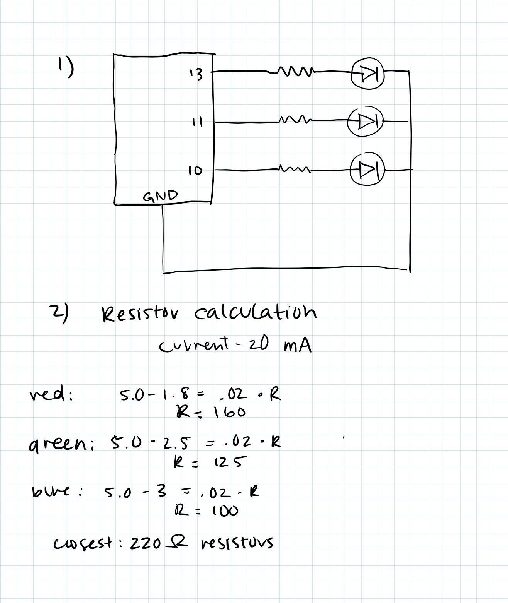
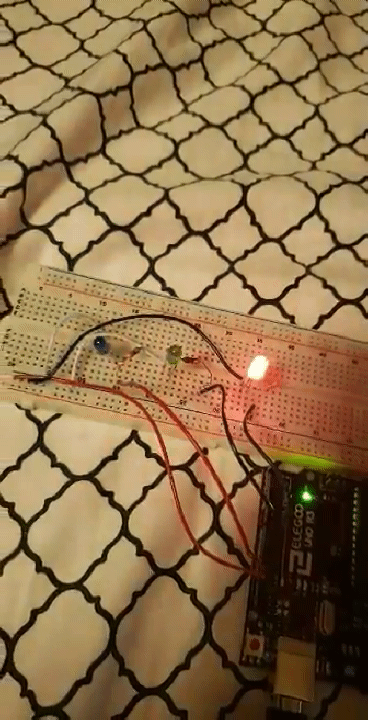

# Assignment 1

### Schematic and Resistor Calculations


### Working Circuit


### Code
```
// the setup function runs once when you press reset or power the board
void setup() {
  // initialize digital pin LED_BUILTIN as an output.
  pinMode(13, OUTPUT);
  pinMode(11, OUTPUT);
  pinMode(10, OUTPUT);
}

// the loop function runs over and over again forever
void loop() {
  //first LED
  digitalWrite(13, HIGH);   // turn the LED on (HIGH is the voltage level)
  delay(1000);                       // wait for a second
  digitalWrite(13, LOW);    // turn the LED off by making the voltage LOW
  delay(1000);                       // wait for a second

  //second LED
  digitalWrite(11, HIGH);   // turn the LED on (HIGH is the voltage level)
  delay(1000);                       // wait for a second
  digitalWrite(11, LOW);    // turn the LED off by making the voltage LOW
  delay(1000);                       // wait for a second

  //third LED
  digitalWrite(10, HIGH);   // turn the LED on (HIGH is the voltage level)
  delay(1000);                       // wait for a second
  digitalWrite(10, LOW);    // turn the LED off by making the voltage LOW
  delay(1000);                       // wait for a second
}

```
