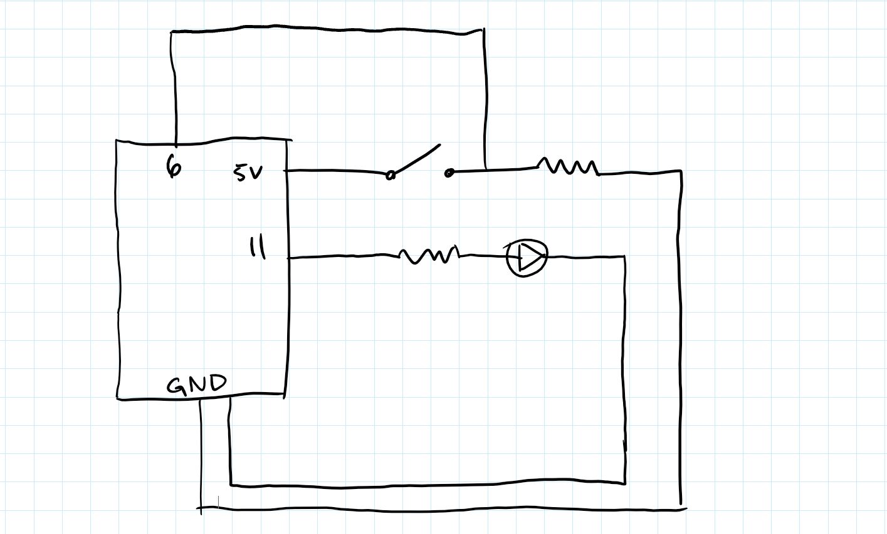
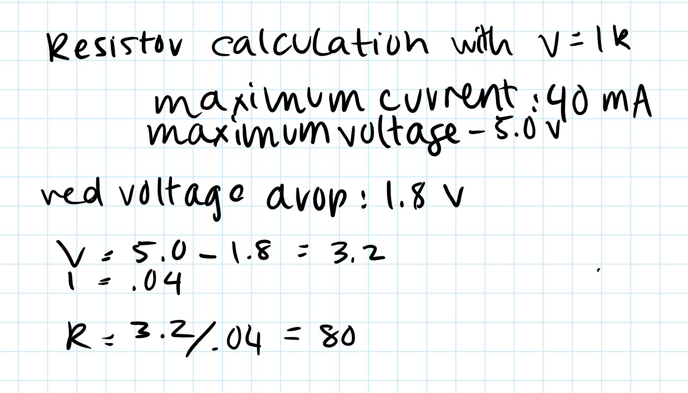
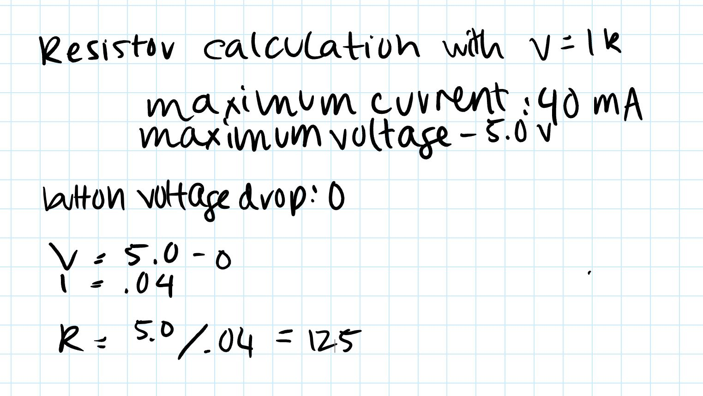
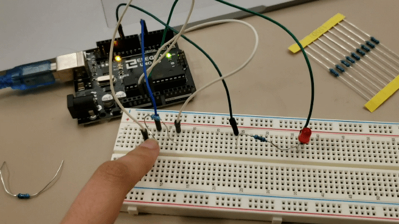

# Assignment 2

This assignment addresses concepts like switches, analog writing, and input pins.

### Overview:

The user can press a button to alter the behavior of an LED. When the button is not pressed, the LED flashes between its high and low states. If the button is pressed, the LED transitions between its highest and lowest state in 256 increments, giving the appearance of smoothly fading. 

### Schematic

### Resistor Calculations
I ended up using a 100 Ohm Resistor for the LED circuit:


I ended up using a 220 Ohm Resistor for the button circuit:


### Code
```
// constants won't change. They're used here to set pin numbers:
const int buttonPin = 6;     // the number of the pushbutton pin
const int ledPin =  11;      // the number of the LED pin

// variables will change:
int buttonState = 0;         // variable for reading the pushbutton status

void setup() {
  // initialize the LED pin as an output:
  pinMode(ledPin, OUTPUT);
  // initialize the pushbutton pin as an input:
  pinMode(buttonPin, INPUT);
}

void loop() {
  // read the state of the pushbutton value:
  buttonState = digitalRead(buttonPin);

  // check if the pushbutton is pressed. If it is, the buttonState is HIGH:
  if (buttonState == HIGH) {
    for (int i = 0; i < 256; i++){ //slowly increase voltage delivered through output pin
      analogWrite(ledPin, i);
      delay(7); //slow down the fade a little
    }
    for (int j = 255; j >= 0; j--){//slowly decrease voltage delivered through output pin
      analogWrite(ledPin, j);
      delay(7);
    }

  } else {//if the button is not being pressed, alternate between high and low WITHOUT fading
    digitalWrite(ledPin, HIGH);
    delay(200); //slow down the flashing
    digitalWrite(ledPin, LOW);
    delay(200);
  }
}
```
### Final Behavior

