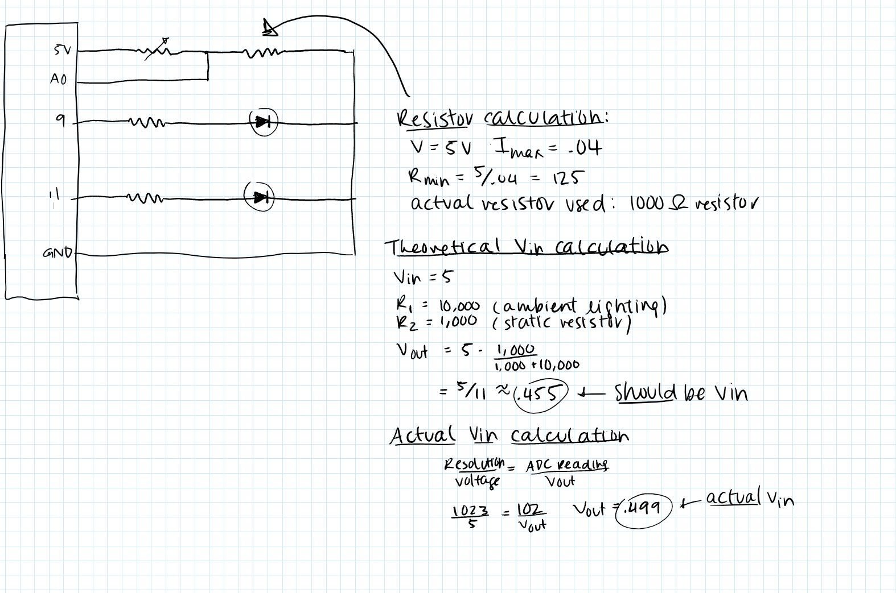
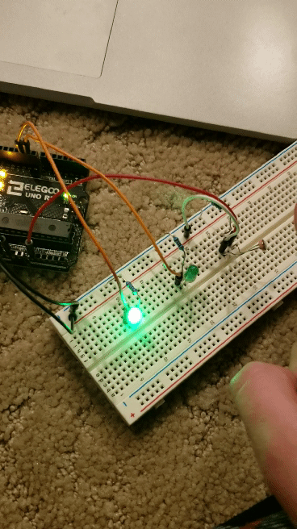

# Assignment 3: Input Output

In this assignment, we used sensors that changed their resistance in response to stimuli. I used a photocell, which decreased its resistance as it was exposed to more light. 



The brightness of the LED is proportional to the amount of light hitting the photocell. Whenever the user blocks enough light from reaching the photocell, the current light turns off and the other light turns on. If the user does this again, the second light shuts off and the original light turns on. 



```
const int analogInPin = A0;  // Analog input pin that the photocell is attached to
const int analogOutPin1 = 9; // Analog output pin that the first LED is attached to
const int analogOutPin2 = 11; // Analog output pin that the second LED is attached to

int sensorValue = 0;        // value read from the pot
int outputValue = 0;        // value output to the PWM (analog out)

bool isOn = false; // is the light currently above or below the threshold?
int lightOn = -1; // is a value that helps calculate which light gets turned on
const int base = 10; // lightOn is subtracted or added to this value, giving
//you either 9 or 11 (the two analogOut pins that I chose)

const int threshold = 50; //the boundary between the light being "on" or "off"

void setup() {
  // initialize serial communications at 9600 bps:
  Serial.begin(9600);
}

void loop() {
  // read the analog in value:
  sensorValue = analogRead(analogInPin);
  // map it to the range of the analog out:
  outputValue = map(sensorValue, 0, 1023, 0, 255);
  // change the analog out value:
  if (sensorValue > threshold && !isOn || sensorValue < threshold && isOn){
    isOn = !isOn;
    if (isOn){
      lightOn = lightOn * -1;
    }
  }
  analogWrite(base - lightOn, 0); //one light is turned off
  analogWrite(base + lightOn, outputValue); // the other is given the mapped value from the photoresistor


  // print the results to the Serial Monitor:
  Serial.print("sensor = ");
  Serial.print(sensorValue);
  Serial.print("\t output = ");
  Serial.println(outputValue);

  // wait 2 milliseconds before the next loop for the analog-to-digital
  // converter to settle after the last reading:
  delay(2);
}
```
