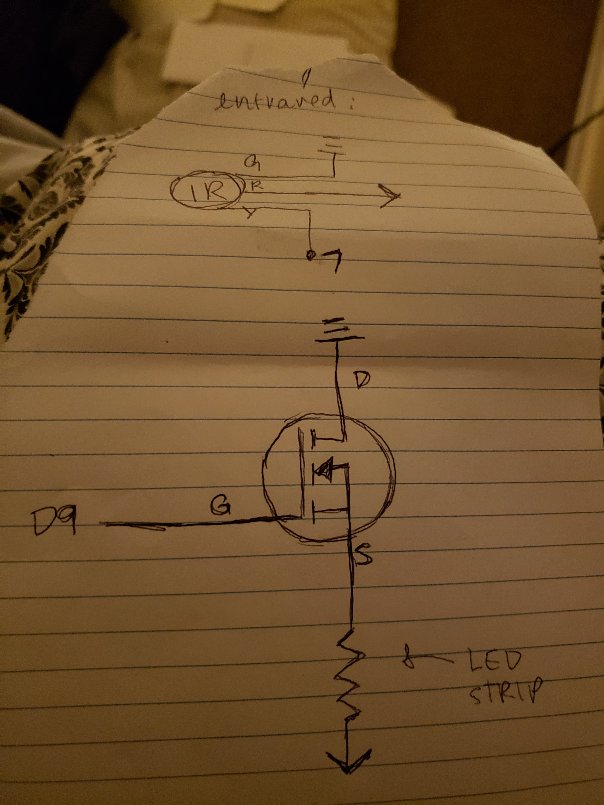

# Assignment 4: High(er) voltage and transistors

In this assignment, we used transistors to modulate the amount of current going through our circuit. Controlling transistors with Arduino pins allowed us to use higher voltage power sources.


Here, the IR remote is sending a signal to an IR receiver. This signal is sent to input pin 7. From this, an analog value for pin 9 (logic power) is calculated and sent to the transistor's gate. This controls the amount of current sent through the LED strip.


When the user hits a button on their remote, the analog output is slowly increased to 255, and then decreased back down to zero.

##Code
``` 
#include <boarddefs.h>
#include <IRremote.h>
#include <IRremoteInt.h>
#include <ir_Lego_PF_BitStreamEncoder.h>

const int RECV_PIN = 7; //pin that reads infrared signal
IRrecv irrecv(RECV_PIN);//new receiver object
decode_results results; //data received from the IR remote

void setup(){
  Serial.begin(9600); //initializes serial connection with speed bits per second
  irrecv.enableIRIn(); //sets up the receiving process, enabling a timing interrupt
  irrecv.blink13(true); //the receiver blinks when a signal is received
  pinMode(9, OUTPUT); //sets up the pin that delivers logic power
}

void loop(){
  //checks if the IR receiver got a signal
  if (irrecv.decode(&results)){
      Serial.println(results.value, HEX); //logs which button is pressed on the remote
      for (int i = 0; i < 256; i++){ //slowly increase voltage delivered through output pin
        analogWrite(9, i); //writes value logic pin that goes to the transistor gate
        delay(7); //slow down the fade a little
      }
      for (int j = 255; j >= 0; j--){//slowly decrease voltage delivered through output pin
        analogWrite(9, j);
        delay(7);
      }
      irrecv.resume();//resets the receiver to prepare it to receive another signal
  }
}
```
