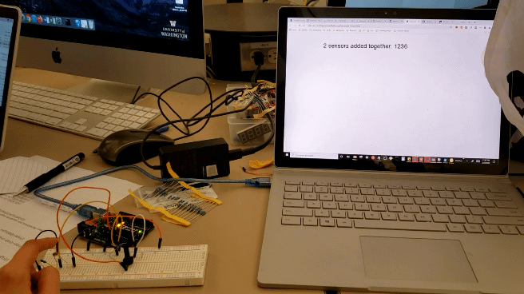

# Assignment 5: Talking to the Web

In this assignment, we used serial communication to write to write sensor data to a webpage.



My circuit uses two sensors to control the position of text on the screen. The photoresistor allows fine control of the text position, with low sensitivity to change in input. The potentiometer allows gross control of the text position, with higher sensitivity to change in input.

## Code

### Arduino Code 

```
void setup(){
  Serial.begin(9600);
}

void loop(){
  Serial.println(analogRead(A0) + analogRead(A1)); //reads voltage from potentiometer and photoresistor, adds them, and 
  //sends them over the serial port.
  delay(50); 
}

```

### p5.js code

```
var serial; // variable to hold an instance of the serialport library
var portName = 'COM6'; //rename to the name of your port
var datain; //some data coming in over serial!
var xPos = 0;


function setup() {
  serial = new p5.SerialPort();       // make a new instance of the serialport library
  serial.on('list', printList);       // set a callback function for the serialport list event
  serial.on('connected', serverConnected); // callback for connecting to the server
  serial.on('open', portOpen);        // callback for the port opening
  serial.on('data', serialEvent);     // callback for when new data arrives
  serial.on('error', serialError);    // callback for errors
  serial.on('close', portClose);      // callback for the port closing
 
  serial.list();                      // list the serial ports
  serial.open(portName);              // open a serial port
  createCanvas(1200, 800);
  background(0x08, 0x16, 0x40);
}
 
// get the list of ports:
function printList(portList) {
 // portList is an array of serial port names
 for (var i = 0; i < portList.length; i++) {
 // Display the list the console:
   print(i + " " + portList[i]);
 }
}

function serverConnected() {
  print('connected to server.');
}
 
function portOpen() {
  print('the serial port opened.')
}
 
function serialError(err) {
  print('Something went wrong with the serial port. ' + err);
}
 
function portClose() {
  print('The serial port closed.');
}

function serialEvent() {
  if (serial.available()) {
  	datain = Number(serial.readLine());
        //console.log(datain);
  } 
}

function graphData(newData) {
  // map the range of the input to the window height:
  var yPos = map(newData, 0, 255, 0, height);
  // draw the line in a pretty color:
  stroke(255, 0, 80);
  line(xPos, height, xPos, height - yPos);
  // at the edge of the screen, go back to the beginning:
  if (xPos >= width) {
    xPos = 0;
    // clear the screen by resetting the background:
    background(0x08, 0x16, 0x40);
  } else {
    // increment the horizontal position for the next reading:
    xPos++;
  }
}

function draw() {
  background(255,255,255); //resets the background to white
  if (datain > 0) //skips the null inputs
	text(("2 sensors added together: " + datain), datain/5,30); // changes the position of the code
}

```
