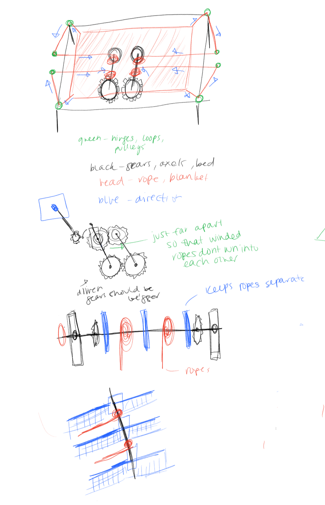
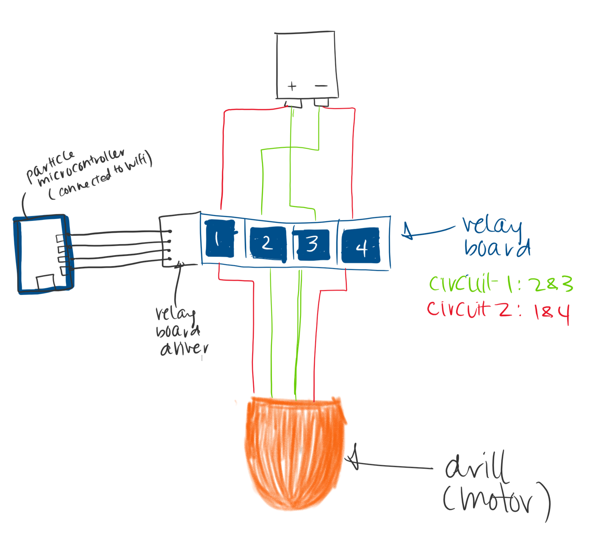

# Final project

This contraption lets you tell Alexa to make your bed.

## How it works

You can do 2 main things: tell Alexa to "make the bed" and tell her to "unmake the bed". Alexa processes the recording of your voice and figures out which of the two you're trying to do, and sends this intent to AWS Lambda. AWS Lambda cleans this information up and sends a POST request to a Particle.io server with key info about whether the motor needs to be turned clockwise or anticlockwise. Particle receives this information and makes function calls on the Particle Photon device, which is connected to your home's WiFi network.  

## Tools and Materials 

-Alexa Skills Kit
-AWS Lambda
-Particle Photon
-Drill
-Threaded rod
-20V lithium ion battery
-MDF boards, wood planks
-Laser cutter and accompanying software
-Adobe Illustrator
-Rope
-Eyebolts 
-Washers
-Corner braces
-1 AWG copper wire cable
-4 relay board

## Sketching/Iteration



## Diagrams

Circuit 


Front of the frame 


Top of the box


Side of the Frame


## Demo

## Code 

```

int clockwise1 = D1;//hybrid yellow, in4
int clockwise2 = D4;//purple, in7    black sticker
int anticlockwise1 = D2;//grey, in6    gold sticker
int anticlockwise2 = D3;//green, in5
int run = D7; //controls power to whole relay board
int sheetLength = 5;
void setup() {
    Particle.function("makeBed2", makeBed); //registers function in particle cloud
    Particle.function("unmakeBed2", unmakeBed); 
    Particle.function("tuckIn2", tuckIn); 
    Particle.function("tweak", tweak); 
    pinMode(D0, OUTPUT);
    pinMode(D1, OUTPUT);
    pinMode(D2, OUTPUT);
    pinMode(D3, OUTPUT);
    pinMode(D4, OUTPUT);
    pinMode(D5, OUTPUT);
    pinMode(D6, OUTPUT);
    pinMode(D7, OUTPUT);
    //digitalWrite(motor, LOW); //ensures motor is off during setup (neccessary?)
}

void loop() {
    
}

/**
 * Makes bed. 
 * @param status--is the bed already made?
 * @returns 0 if bed was successfully made, 
 * 2 if the bed was already made
 * 
 **/
int makeBed(String status){
    bool bedMade = status.equals("true"); 
    if (bedMade)
        return 2; 
    else{
        runClockwise(8000);
    }
    return 0;
}

/**
 * Unmakes bed. 
 * @param status--is the bed already made?
 * @returns 0 if bed was unmade, 
 * 3 if the bed was already unmade
 * 
 **/
int unmakeBed(String status){
    bool bedMade = status.equals("true");
    if (!bedMade)
        return 3; 
    else{
        runAntiClockwise(8000);
    }
    return 0;
}

/**
 * Tucks person in. 
 * @param status--is the bed already made?
 * @returns 0 if person was successfully tucked in,
 * 10 if the person was already tucked in. 
 * 
 **/
int tuckIn(String status){
    int outcome1 = makeBed(status); //tucks in 
    int outcome2 = unmakeBed(status); //allows for freely moving in sleep
    return (outcome1 + outcome2) * 5; 
}


void runClockwise(int time){
    digitalWrite(anticlockwise1, HIGH); //RELAY SWITCHES ARE INVERTED
    digitalWrite(anticlockwise2, HIGH);
    digitalWrite(clockwise1, LOW);
    digitalWrite(clockwise2, LOW);
    runBedMaker(time);
}

void runAntiClockwise(int time){
    digitalWrite(clockwise1, HIGH); 
    digitalWrite(clockwise2, HIGH);
    digitalWrite(anticlockwise1, LOW);
    digitalWrite(anticlockwise2, LOW);
    runBedMaker(time);
}

void runBedMaker(int time){
    int clicks = time/1000;
    for (int i = 0; i < clicks; i++){
        digitalWrite(run, HIGH); //NOT INVERTED
        delay(100);
        digitalWrite(run, LOW); 
        delay(900);
    }
}

int tweak(String parameters){
    String orientation  = parameters.substring(0, 1);
    int time = parameters.substring (2).toInt();
    if (orientation == "c"){
        runClockwise(time);
        return 0;
    }
    else if (orientation == "a"){
        runAntiClockwise(time);
        return 0;
    }
    return 1;
}

```

Alexa intent handlers 

```Learn more or give us feedback
const Alexa = require('alexa-sdk');
const AWS = require('aws-sdk');

//parameters for calling different functions
var pHostname = "api.particle.io";
var pPort = 443;
var pPath = "/v1/devices/";
var id1 = "270038001347353136383631";
var token1 = "cd80211aa8ebe0e80cd48729994cf2244151197d";
var functionName;
var data;
var https = require("https");
var requestType = "POST"
var bedMade = true; 

function getOptions(){
    return {
        hostname : pHostname,
        port: pPort, 
        path: pPath + id1 + "/" +functionName,
        method: requestType, 
        headers: {
            'Content-Type': 'application/x-www-form-urlencoded'
        }
    };
}

function makePOSTRequest(){
    options = getOptions();
    console.log(options.path)
    var req = https.request(options); 
    req.write(data);
    req.end();
}

function makeBed(){
    functionName = "makeBed2"; 
    var status = "false";
    data = "access_token=" + token1 + "&args=" + status; 
    console.log(data);
    makePOSTRequest();
    bedMade = true; 
}

function unmakeBed(){
    functionName = "unmakeBed2"; 
        var status = "true";
        data = "access_token=" + token1 + "&args=" + status; 
        console.log(data);
        makePOSTRequest();
        bedMade = false; 
}


const handlers = {
    'makeBed': function () {
        if (!bedMade){
            makeBed();
            this.emit(":tell", "Mister snoozle is making your bed ");
        } else {
            this.emit(":tell", "Mister snoozle says your bed is already made.");
        }
    },
    
    'unmakeBed': function () {
        if (bedMade){
            unmakeBed();
            this.emit(":tell", "Mister snoozle is preparing your bed ");
        } else {
            this.emit(":tell", "Mister snoozle says your bed isn't even made.");
        }
    }
};

exports.handler = (event, context, callback) => {
    var alexa = Alexa.handler(event, context, callback);
    alexa.registerHandlers(handlers);
    alexa.execute();
};
```
